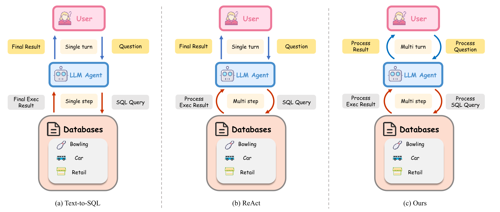
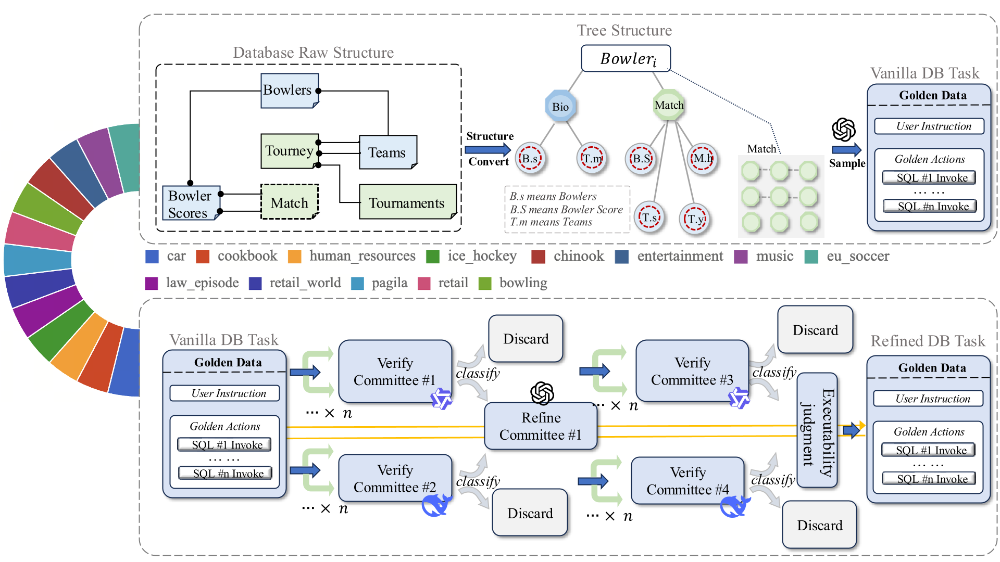

<h1 align="center">Rethinking Text-to-SQL: Dynamic Multi-turn SQL Interaction for Real-world Database Exploration</h1>

<p align="center" style="font-size: 16px;">
    Linzhuang Sun1†, Tianyu Guo2†, Hao Liang2†, Yuying Li3, Qifeng Cai2, Jingxuan Wei1, Bihui Yu1,
    Wentao Zhang*, Bin Cui*
</p>
<p align="center" style="font-size: 12px;"><i>(* corresponding author, † equal contribution)</i></p>

<p align="center">
  <a href="https://arxiv.org/abs/2510.26495"></a>
  <a href="https://huggingface.co/datasets/gtysssp/Real-World-SQL-Bench-Databases"></a>
</p>


This repository contains the official implementation of our paper, **"Rethinking Text-to-SQL: Dynamic Multi-turn SQL Interaction for Real-world Database Exploration"**.

<div style="width:100%; overflow-x:auto;">
  <table style="width:100%;">
    <tr>
      <td align="center" style="width:20%;"><br>
        <br>
        <b>Overview of interaction types between user, LLM agent, and database.
From left to right: (a) direct Text-to-SQL execution, (b) iterative reasoning within a single query (ReAct), and (c) our approach enabling multi-step, multi-turn contextual execution.</b>
      </td>     
    </tr>
  </table>
</div>

We introduce **DySQL-Bench**, a benchmark designed to evaluate Text-to-SQL models in dynamic, multi-turn database interactions. It highlights the limitations of current approaches when handling evolving user intents and iterative query revisions, and provides an automated evaluation framework that covers all CRUD operations — namely Create, Read, Update, and Delete — across 1,072 realistic tasks. This work rethinks how Text-to-SQL systems can better support real-world, conversational database exploration.

## Task generation pipeline
<div style="width:100%; overflow-x:auto;">
  <table style="width:100%;">
    <tr>
      <td align="center" style="width:20%;"><br>
        <br>
        <b>Our task generation pipeline.</b>
      </td>     
    </tr>
  </table>
</div>

DySQL-Bench constructs its benchmark data through a two-stage automatic synthesis and verification pipeline designed to simulate realistic multi-turn Text-to-SQL interactions.

**Vanilla DB Task Generation**: In the first stage, raw relational databases from sources such as BIRD and Spider2 are transformed into hierarchical tree-structured representations that capture logical relationships among tables. Each tree centers on a primary table (the root node) and recursively links related records through foreign keys. These structured trees serve as input to large language models, which generate user instructions and corresponding SQL action sequences representing realistic database operations.

**Refined DB Task Verification**: In the second stage, an LLM-based Verifier Committee validates each generated task, checking for semantic alignment, schema validity, and SQL executability. Invalid samples are filtered out, and refined instructions are backfilled with missing parameters. Tasks passing automated validation are then manually reviewed by human experts to ensure correctness and execution consistency.

Finally, only tasks that meet all quality criteria are included in the benchmark. The resulting dataset spans 13 domains and covers the full CRUD spectrum, offering 1,072 semantically correct, executable, and contextually rich tasks for evaluating multi-turn Text-to-SQL reasoning.


## Task Generation Pipeline

1. Vanilla QA Task Generation

Sample from the tree-structured data pool and use an LLM to generate initial tasks.
```bash
python generate_sqlbench_qa_multiTurn_qa-openai.py
```
> Converts the LLM-generated tasks into JSON format: python extract_qa.py

2. Task Verification Process

Use the LLM as a verifier to determine whether the initial task's golden label successfully addresses the instruction.

```bash
python verify_qa_voting_openai.py
```
> split quality tasks: python verify_qa_voting_then_split.py


3. Task Refinement Process

Use the LLM as a refiner to improve the task's instruction description based on the task's golden action.

```bash
python generate_refine_sqlbench_qa.py
```

4. Save Tasks for Database Update

Retain tasks that involve update operations on the database.

```bash
python format_bench_wo_output.py
```

## Benchmark Evaluation

1. Clone the repository and install the environment.
```bash
git clone https://github.com/Aurora-slz/Real-World-SQL-Bench.git

cd ./Real-World-SQL-Bench/DySQL-Bench

conda create -n venv
conda activate venv
pip install -e .

```

2. Download the databases

This will download all the 13 databases.
```bash
python ./scripts/fetch_dbs.py --all
```

Run the tasks. We offer two scipts to run the task.
```bash
# You can run a single task.
python run.py \
    --env pagila \
    --model agent_model_name \
    --model-api agent_model_api \
    --max-concurrency 1 \
    --num-trials 5 \
    --user-model user_model_name \
    --user-model-api user_model_api \
    --user-strategy llm \

# Or you can run multiple tasks.
python run_multi_task.py --agent-model agent_model_name --user-model user_model_name --num-trials 1 --all 

```
